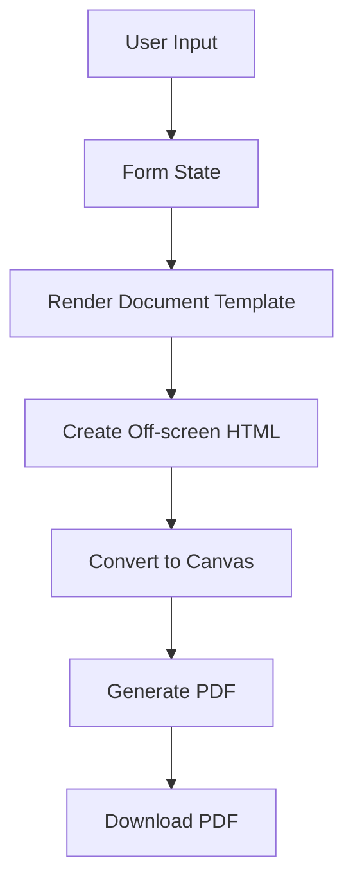
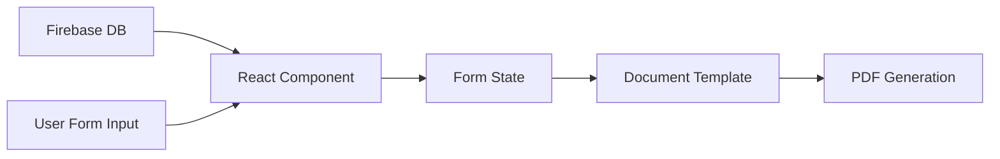

# Employee Document Generator - PDF Generation Overview

## 1. Executive Summary

The Employee Document Generator is a React application that creates and generates downloadable PDF documents for various employment-related purposes. It uses client-side PDF generation through HTML-to-PDF conversion, with a consistent approach across multiple document types.

## 2. Architecture Overview

### 2.1 PDF Generation Approach

The application uses a client-side HTML-to-PDF conversion approach with the following workflow:
1. Render document content as HTML using React components
2. Create an off-screen representation of the document
3. Convert HTML to canvas objects
4. Transform canvas objects into a PDF document
5. Trigger download of the generated PDF

### 2.2 Core Libraries and Dependencies

```json
{
  "dependencies": {
    "html2canvas": "^1.4.1",     // Converts HTML elements to canvas objects
    "html2pdf.js": "^0.10.2",    // Alternative HTML-to-PDF conversion (used in PaySlip component)
    "jspdf": "^2.5.2",           // Generates PDF documents
    "react": "^19.0.0",          // UI rendering
    "firebase": "^11.3.0"        // Database for document data
  }
}
```

### 2.3 System Components

1. **Document Template Components** - React components that define the visual structure of each document type
2. **PDF Generation Logic** - Functions to convert HTML to PDF using jsPDF and html2canvas
3. **Custom Hook** - `useDownloadPDF` hook that encapsulates PDF generation functionality
4. **Form Interface** - UI for users to input document details
5. **Firebase Integration** - Backend connection to retrieve and store document data

## 3. Implementation Details

### 3.1 PDF Generation Process Flow



### 3.2 Core Implementation Pattern

All document templates follow this pattern:

1. Create a ref to access the document container: `const containerRef = React.useRef(null);`
2. Implement a download function:
   ```javascript
   const handleDownload = async () => {
     if (!containerRef.current) return;
     
     // Initialize PDF with A4 size in portrait mode
     const pdf = new jsPDF("p", "mm", "a4");
     
     // Get all pages of the document
     const elements = containerRef.current.getElementsByClassName("document-page-class");
     
     // Process each page
     for (let i = 0; i < elements.length; i++) {
       // Convert HTML to canvas
       const canvas = await html2canvas(elements[i]);
       const imgData = canvas.toDataURL("image/jpeg", 1.0);
       
       // Add new page for pages after the first
       if (i > 0) pdf.addPage();
       
       // Set dimensions and add image to PDF
       const pdfWidth = pdf.internal.pageSize.getWidth();
       const pdfHeight = pdf.internal.pageSize.getHeight();
       pdf.addImage(imgData, "JPEG", 0, 0, pdfWidth, pdfHeight);
     }
     
     // Trigger download
     pdf.save("document-name.pdf");
   };
   ```
3. Render an off-screen container:
   ```jsx
   <div ref={containerRef} style={{ position: 'absolute', left: '-9999px', top: '-9999px' }}>
     <div className="document-page-class bg-white" style={{ width: '210mm', minHeight: '297mm', padding: '20mm' }}>
       {/* Document content */}
     </div>
   </div>
   ```
4. Implement a download button:
   ```jsx
   <button onClick={handleDownload} className="download-btn">
     <Download size={18} className="mr-2" />
     <span>Generate Document</span>
   </button>
   ```

### 3.3 Custom Hook Implementation

The application includes a reusable hook (`useDownloadPDF`) that encapsulates PDF generation logic:

```javascript
// src/hooks/useDownloadPDF.js
import { useRef } from "react";
import jsPDF from "jspdf";
import html2canvas from "html2canvas";

export function useDownloadPDF() {
  const containerRef = useRef(null);

  const handleDownload = async () => {
    if (!containerRef.current) return;

    const pdf = new jsPDF("p", "mm", "a4");
    const elements =
      containerRef.current.getElementsByClassName("offer-letter-page");

    for (let i = 0; i < elements.length; i++) {
      const canvas = await html2canvas(elements[i]);
      const imgData = canvas.toDataURL("image/jpeg", 1.0);

      if (i > 0) {
        pdf.addPage();
      }

      const pdfWidth = pdf.internal.pageSize.getWidth();
      const pdfHeight = pdf.internal.pageSize.getHeight();
      pdf.addImage(imgData, "JPEG", 0, 0, pdfWidth, pdfHeight);
    }

    pdf.save("document.pdf");
  };

  return { containerRef, handleDownload };
}
```

However, this hook is not consistently used across all document templates. Most templates implement their own version of the PDF generation logic.

## 4. Document Template Implementation

### 4.1 Supported Document Types

| Document Type | File Path | Page Class | Output Filename |
|---------------|-----------|------------|----------------|
| Appointment Letter | src/pages/AppointmentLetter.js | appointment-letter-page | appointment-letter.pdf |
| Offer Letter | src/pages/OfferLetter.js | offer-letter-page | offer-letter.pdf |
| Relieving Letter | src/pages/RelievingLetter.js | relieving-letter-page | relieving-letter.pdf |
| Appraisal Letter | src/pages/AppraisalLetter.js | appraisal-letter-page | appraisal-letter.pdf |
| Increment Letter | src/pages/IncrementLetter.js | increment-letter-page | increment-letter.pdf |
| Pay Slip | src/components/PaySlip.js | payslip-page | PaySlip_[name]_[date].pdf |

### 4.2 Document Structure Pattern

Each document template follows a consistent structure:

1. **Header Section** - Company name, logo, and details
2. **Content Section** - Document-specific content
3. **Footer Section** - Footer information and page numbers

### 4.3 HTML Structure for PDF Generation

```jsx
<div ref={containerRef} style={{ position: 'absolute', left: '-9999px', top: '-9999px' }}>
  {/* Page 1 */}
  <div className="[document-type]-page bg-white" style={{ width: '210mm', minHeight: '297mm', padding: '20mm' }}>
    {/* Header */}
    <div className="letter-header" style={{ borderBottomColor: formData.companyColor, borderBottomStyle: "solid", borderBottomWidth: "1px" }}>
      <div className="company-info">
        <h1 className="company-name">{formData.companyName}</h1>
        <p className="company-address">{formData.companyAddressLine1}</p>
      </div>
      
    </div>
    
    {/* Content */}
    <div className="letter-content">
      {/* Document-specific content */}
    </div>
    
    {/* Footer */}
    <div className="footer" style={{ borderTopColor: formData.companyColor, borderTopStyle: "solid", borderTopWidth: "1px" }}>
      <p>{formData.companyName}</p>
      <p>{formData.companyAddressLine1}</p>
    </div>
  </div>
  
  {/* Additional pages follow the same pattern */}
</div>
```

## 5. Data Integration

### 5.1 Data Sources

1. **Form Inputs** - User input from form controls
2. **Firebase Firestore** - Company and candidate data
3. **Calculated Values** - Computed data such as salary components

### 5.2 Data Flow Process



### 5.3 Key Data Transformation Functions

- **formatDate** - Converts date strings to formatted dates (e.g., "05 Feb 2025")
- **calculateSalaryComponents** - Computes salary breakdown from total package
- **numberToWords** - Converts numeric values to word representation

## 6. Implementation Variations

### 6.1 Standard Implementation (Most Documents)

Uses direct jsPDF and html2canvas approach:

```javascript
const handleDownload = async () => {
  if (!containerRef.current) return;
  const pdf = new jsPDF("p", "mm", "a4");
  const elements = containerRef.current.getElementsByClassName("document-page-class");

  for (let i = 0; i < elements.length; i++) {
    const canvas = await html2canvas(elements[i]);
    const imgData = canvas.toDataURL("image/jpeg", 1.0);
    if (i > 0) pdf.addPage();
    const pdfWidth = pdf.internal.pageSize.getWidth();
    const pdfHeight = pdf.internal.pageSize.getHeight();
    pdf.addImage(imgData, "JPEG", 0, 0, pdfWidth, pdfHeight);
  }

  pdf.save("document-name.pdf");
};
```

### 6.2 PaySlip Implementation

Uses html2pdf.js library with more configuration options:

```javascript
const handleDownloadPDF = async () => {
  // Generate HTML content
  const content = `<div class="payslip-container">...</div>`;
  
  // Configure options
  const opt = {
    margin: 10,
    filename: `PaySlip_${companyDetails?.employeeName || "Employee"}_${formatDate(companyDetails?.doj)}.pdf`,
    image: { type: "jpeg", quality: 0.98 },
    html2canvas: {
      scale: 2,
      useCORS: true,
      logging: true,
      allowTaint: true,
      imageTimeout: 2000,
      backgroundColor: "#ffffff",
    },
    jsPDF: {
      unit: "mm",
      format: "a4",
      orientation: "portrait",
      compress: true,
    },
  };
  
  // Generate and download PDF
  html2pdf().from(content).set(opt).save();
};
```

## 7. Enhancement Opportunities

### 7.1 Code Consolidation

- **Standardize on `useDownloadPDF` Hook**: Refactor all documents to use the common hook
- **Create a Shared PDF Generation Service**: Extract PDF generation logic to a dedicated service

### 7.2 Performance Improvements

- **Canvas Optimization**: Configure html2canvas for better performance with complex content
- **Implement Pagination Logic**: Add explicit page breaks for better control over multi-page documents

### 7.3 Alternative Approaches

#### 7.3.1 Server-Side PDF Generation

Using a server-side approach with Puppeteer:

```javascript
// Server-side code (Next.js API route example)
export async function POST(req) {
  const { html } = await req.json();
  
  const browser = await puppeteer.launch();
  const page = await browser.newPage();
  await page.setContent(html, { waitUntil: "networkidle0" });
  const pdfBuffer = await page.pdf({
    format: "A4",
    printBackground: true,
    margin: { top: "1cm", right: "1cm", bottom: "1cm", left: "1cm" }
  });
  await browser.close();
  
  return new Response(pdfBuffer, {
    status: 200,
    headers: {
      "Content-Type": "application/pdf",
      "Content-Disposition": `attachment; filename=document.pdf`,
    },
  });
}
```

#### 7.3.2 CSS Paged Media

Using dedicated CSS Paged Media libraries:

- **WeasyPrint**: Python-based HTML to PDF converter
- **Prince**: Commercial HTML to PDF converter with superior CSS support
- **PDFReactor**: Java-based HTML to PDF conversion with stronger CSS support

## 8. References

- [jsPDF Documentation](https://github.com/parallax/jsPDF)
- [html2canvas Documentation](https://github.com/niklasvh/html2canvas)
- [Smashing Magazine: How To Create A PDF From Your Web Application](https://www.smashingmagazine.com/2019/06/create-pdf-web-application/)
- [Dynamic HTML to PDF Generation in Next.js with Puppeteer](https://medium.com/front-end-weekly/dynamic-html-to-pdf-generation-in-next-js-a-step-by-step-guide-with-puppeteer-dbcf276375d7)
- [Creating a Next.js API to Convert HTML to PDF with Puppeteer](https://dev.to/harshvats2000/creating-a-nextjs-api-to-convert-html-to-pdf-with-puppeteer-vercel-compatible-16fc) 